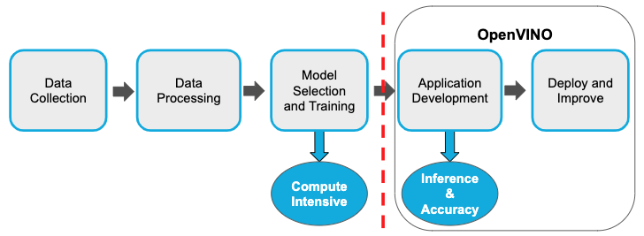
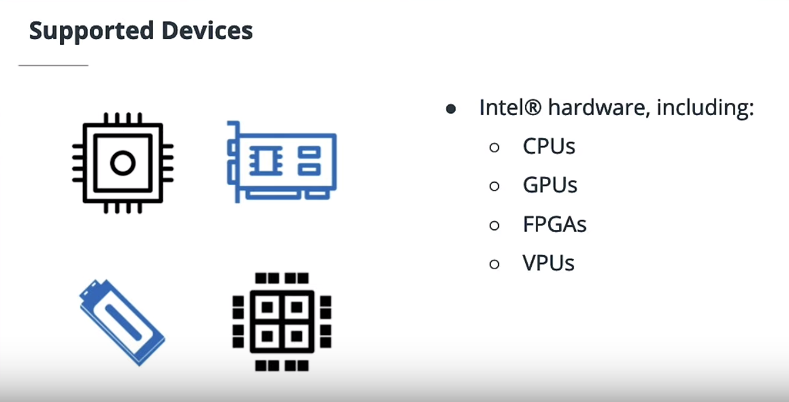
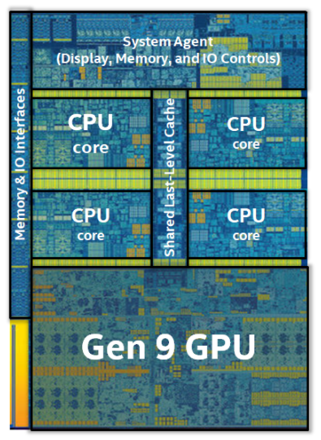
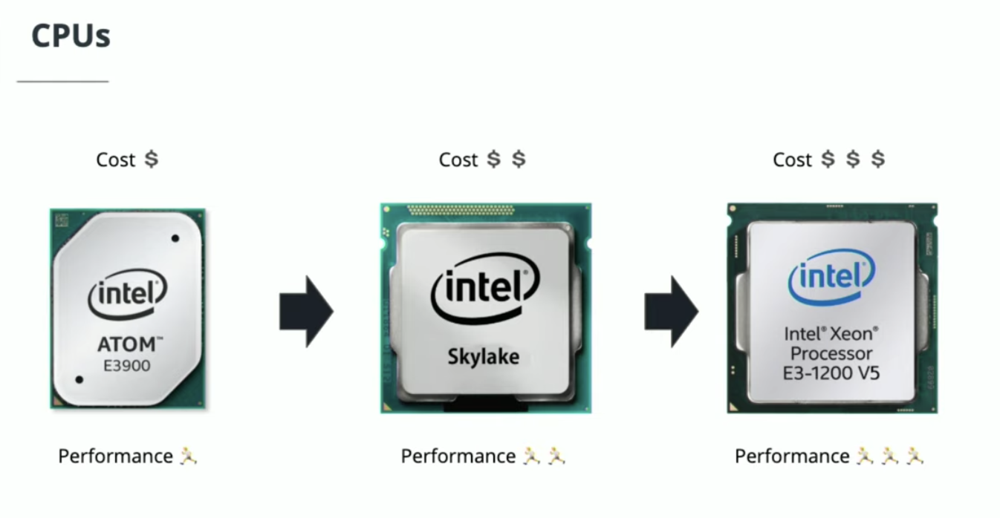
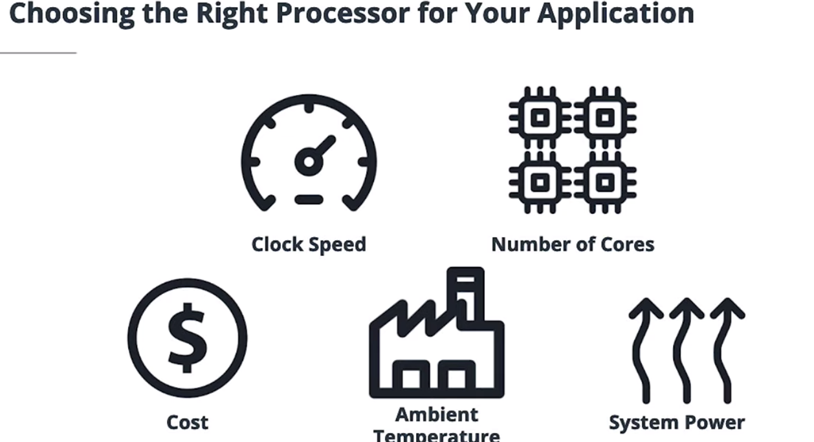
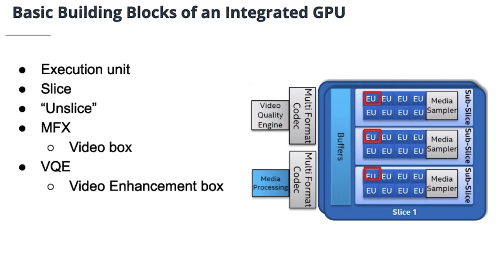
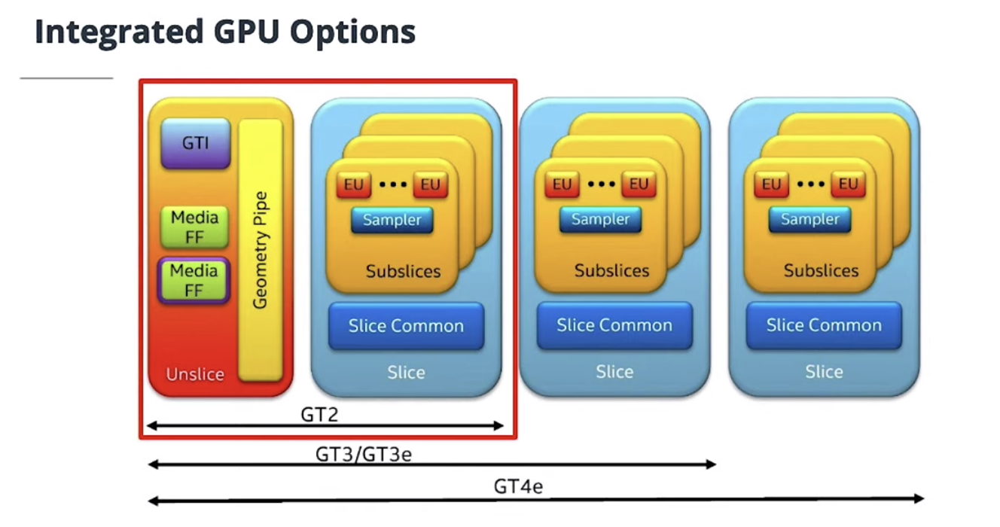
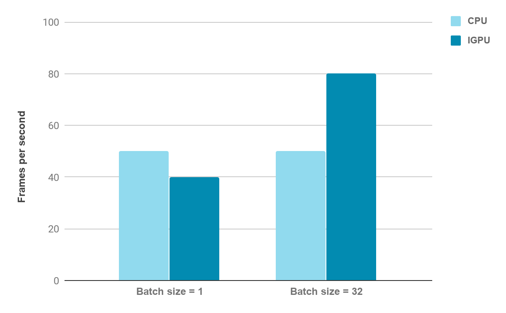
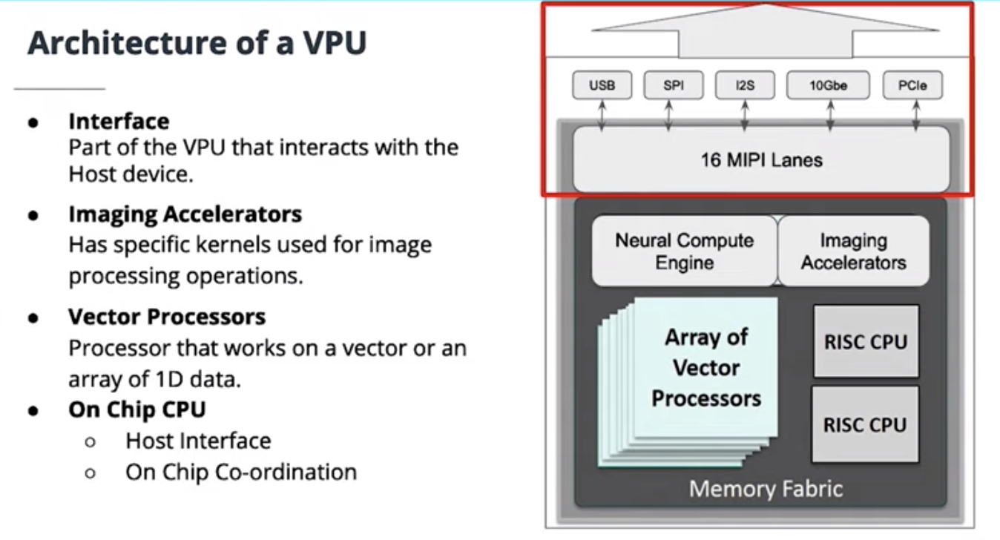
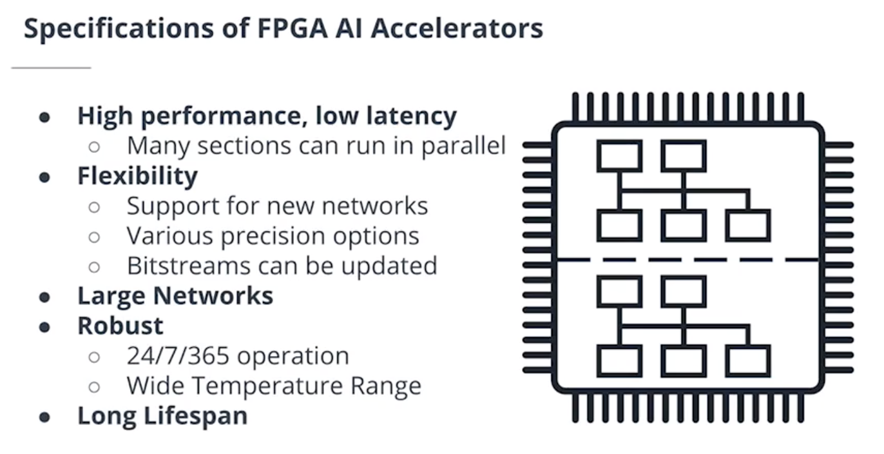

# Why is Choosing the Right Hardware Important?

The development of Edge AI projects involves the following steps:

- Data collection
- Data processing 
- Model selection and training (Compute Intensive)
- Application Deployment (Inference & Accuracy)
- Deploy and Improve

Broadly speaking, there two parts involved in developing Edge AI application. The firts part involves collecting and using data to train models. The second part involves deploying the pretrained models to the location where it is needed and running inference.This stage is done on the edge using OpenVINO.

There are a lot of factors to consider when selecting which hardware is most appropriate for a given situation or project. You will need to consider how well the model will run on the device and whether the device might have a great performance for the model you are using, but too expensive for the client. Or it might be a great price, but turn out to be incompatible with their current system.

This part is essential for ensuring that the edge system provides an effective and practical solution for the client's problem.

## Basic Approach to Developing an Edge AI Application

The development of Edge AI system can be viewed as a cycle that involves five steps: 

The final step of this development is **test and deploy**. At this point, you may have a pretty good idea of what hardware you think will work best for your application-but you really can't know until you **test** it. Purchasing the hardware to test your application would be prohibitively expensive and isn't necessary, therefore your laptop or virtual machine would be a great starting point. This is where the Intel's DevCloud plays a key role in testing different hardware devices performance before deployment. More information [here](https://devcloud.intel.com/edge/ ).

**Supported Devives**

#Hardware Devices for Edge AI Application 

## CPU

 A CPU or Central Processing Unit is the electronic circuitry that executes the instructions of a computer program.

In the image above, the chip contain multiple CPUs or cores which can be use for **multicore processing**. A multicore processor is a computer chip that has multiple CPUs (called cores).

The advantage of having multiple cores is that the CPU can execute multiple processes simultaneously. 

Similarly, multithreading is the act of executing multiple threads simultaneously. Note, different languages handle multiprocessing and multithreading differently. But often yoiu will see that multiprocessing refers to true _parallelism_ while _multithreading_ refers to _concurrency_.

For more details on [multithreading](https://www.internalpointers.com/post/gentle-introduction-multithreading) and [multiprocessing](https://medium.com/contentsquare-engineering-blog/multithreading-vs-multiprocessing-in-python-ece023ad55a).

In addition to standard multiprocessing, you should be aware that Intel processors also have an ability to perform something called _hyperthreading_. For example, a CPU with four physical cores will be recognised (by the computer's OS) as having eight virtual cores. This cores allow multiple thread of execution to be run on a single physical core at the same time.

Hyperthreading can lead to a performance increase, although this improvement is not as great as if you used a CPU that had the equivalent number of real, physical cores.

## CPU Specifications

In this section I discussed some of the CPU specifications and factors you should consider when selecting a processor for your edge device:

- Clock Speed
- Number of Cores
- Cost
- Performance
- Power Requirement
- Ambient temperature
- Lifespan

## Integrated GPU (IGPU)

In the image above, we can see that the chip also contain GPU or **Graphic Processing Unit**. And as I mentioned, all Intel processors contain a GPU or **Graphic Processing Unit** and since this GPU is located on the same chip and shares the same memory with the CPUs, it is referred to as Integrated GPU. 

An integrated GPU (IGPU) is a GPU that is located on a processor alongside the CPU cores and shares memory with them. The basic building blocks are:

- Execution Units (EUs) are processors optimised for multi-threading. Each EU can run up to seven threads simultaneously.
- A slice is a collection of 24 EUs. Slices handle computational tasks,. such as running inference with OpenVINO.
- The Unslice is the remainder of the IGPU. It's main function are to support video playback functions. 

Note: It is the decoupling of the slice and unslice is what allows for OpenVINO inference to run on the Execution Units on the slice, while the video playback, if required, is handled by the unslice.

## Key Characteristics of IGPUs

- Configurable Power Consumption. The clock rate for the slice and unslice can be controlled separately. This means that unused sections in a GPU can be powered down to reduce power consumption. 

- OpenCL Startup Time. When loading a model, OpenCL uses a just-in-time compiler to compile the code for whatever hardware is being used. With an IGPU, this can lead to significantly longer model load times when compared to the same OpenVINO application running on just a CPU. 

- Model Precision and Speed. On IGPUs, the Execution Unit instruction set and hardware are optimized for 16bit floating point data types. This improves inference speed, as we can process twice as many 16bit operands per clock cycle as we can when using 32 bit operands. 

- Shared Components. The CPU and IGPU are present on the same die and they share the same system memory, higher-level caches, and memory controller. This reduces memory latency by speeding up data transfer between the two devices. 

## IGPU and Batch Processing 

Another key characteristic of IGPUs is related to the relationship between performance and batch size. Here is an illustration of a typical scenario, comparing the frames per second between a CPU and IGPU when the data is processed in a batch size of 1 vs. a batch size of 32: 

** In other words, IGPUs generally can handle much larger number of processes at once. For more information, checkout this [documentation](https://software.intel.com/content/www/us/en/develop/articles/accelerate-deep-learning-inference-with-integrated-intel-processor-graphics-rev-2-0.html ).

## VPU 

In some scenarios, you may find that you need to upgrade your system in order to improve the performance and run the types of inference you need-but you might not have the budget to fully replace your current hardware. This is where VPU comes to play. VPU 

**Vision Processing Units (VPUs)** are accelerators that are specialised for AI tasks related to computer vision-such as Convolutional Neural Networks (CNN) and image processing.

VPU provides a cost-efficient way to add performance to a pre-existing system. VPUs are small, low cost, low-power devices that can dramatically improve the performance of a system without the need to uppgrade the other device.

NOTE: VPU is an accelerator, meaning that it accelerates the performance of the pre-existing CPU. The CPU doesn't need to be a powerful one, since it will not actually be doing any calculations-we could use a simple Atom Processor or even a Raspberry Pi-but it is need in order to coordinate the flow of data to and from the VPU.

## Architecture of VPUs 

Intel VPUs consists of the following parts: 

- Interface unit 

- Imaging accelerators 

- Neural compute engine 

- Vector processors 

- On-chip CPUs 

## Myriad X Characteristics 

**Neural compute engine**. The Myriad X features a neural compute engine, which is a dedicated hardware accelerator optimized for running deep learning neural networks at low power without any loss in accuracy. 

These accelerators are used in advanced 3D imaging devices, such as [Intel’s Realsense 3D cameras](https://www.intel.com/content/www/us/en/architecture-and-technology/realsense-overview.html). 

**On-chip memory**. The Myriad X has 2.5 Mbytes of on-chip memory. This is key to minimizing off-chip data movement, which in turn reduces latency and power consumption. 

**Energy consumption**. The Myriad X has a very low power consumption of only 1-2 watts. 

## Intel Neural Compute Stick 2 

So how do we actually connect VPUs to a pre-existing system? One hardware solution is the Intel Neural Compute Stick 2.

The **Neural Compute Stick 2 (NCS2)** is a USB3.1 plug and play removable VPU for AI inferencing. 

### Here are the key features of the Intel NCS2: 

- **VPU**. The processor in the NCS2 is the Myriad X VPU. 

- **Software development kit**. With the integration of OpenVino Toolkit the Intel NCS2 offers pre-trained models to be run on the stick. This allows ease in the use of the hardware. 

- **Operating System**. The NCS2 supports all of the same operating systems as OpenVINO, including Ubuntu, Windows 10, and MacOS. 

**Precision**. The NCS2 only supports FP16 model precision. 

- **Interface**. The NCS2 has a convenient USB3.1 plug and play interface. Note that the NCS2 can be used on systems with only a USB2 port, but the inference will run slower due to I/O throttling. 

- **Cost**. Compared to other AI accelerators, the NCS2 is an inexpensive option, typically costing around $70 to $100. 

- **Scalability**. Adding multiple NCS2s (or other Myriad X devices) will allow multiple inferences to run in parallel. 

- **Size**. All of these features come in a small size of 72.5mm X 27mm X 14mm, with the looks of a standard thumb drive. 

## FPS vs. Power Trade-off 

One other characteristic that is important to note about the NCS2 is that it is meant to be a low-power device so that it can be easily deployed at the edge; however, one drawback of this is that it cannot process as many frames per second (FPS) as some other devices and thus it has a higher inference time. 

## FPGA

Before discusing the **Field Programmable Gate Arrays (FPGAs)**, it will be helful to briefly differentiate FPGA from it's alternative, ASICs.

**Application-Specific Integrated Circuits (ASICs)** are chips that are hardwired during manufacturing in order to be optimally efficient for a specific need. Therefore, ASICs are often used in devices that have specific functions that aren't going to change over time.

Developing this custom circuit is going to be very expensive, but the cost is offset by having an optimal circuit that can be used in a very large number of devices.  

This is very different from an **FPGA**.

**Field-Programmable Gate Arrays (FPGAs)** are chips designed with maximum flexibility, so that they can be reprogrammed as needed in the field (i.e., after manufacturing and deployment). 

This reprogrammability makes FPGA good for prototyping and low-volume production. 

### Architecture of FPGAs 

One important component of FPGA is a _tile_ or _Adaptive Logic Module (ALM)_. A tile consists of three major blocks:

- **Configurable Logic Blocks (CLBs)** form the core of the FPGA and there are typically thousands of these per FPGA. Each block can implement its own function using look up tables.

- **Programmable Interconnects**, which are made up of Connection Blocks (CBs) and Switch Block (SBs), steer the input and outputs of the CLBs.

- **Programmable I/O Blocks** connect the tile to an external circuit for input and output. These external circuits are external to the current tile, but still internal to the overall FPGA. They can be other tiles, Digital Signal Processing blocks (DSPs), memory blocks, or even more I/O blocks.

## FPGA Specifications 

In this sectio I discuss some of the specifications of FPGAs that differentiate them from other hardware types.

**High performance, low latency**. Once programmed with a suitable bitstream, FPGAs can execute neural networks with high performance and very little latency. The high performance comes from the ability to run many sections of the FPGA in parallel. FPGAs also flow the data from one layer to the next, while keeping the data from one output to the next input layer on the same FPGA device. When running a neural network, we run the whole thing on the FPGA so the FPGAs don't go off-chip for the memory. This is faster than sending the output back to the CPU over the PCIe bus. 

**Flexibility**. FPGAs are flexible in a few different ways: 

- They are field-programmable; they can be reprogrammed to adapt to new, evolving, and custom networks 

- Various precision options (FP16, 11 and 9 bit ) are supported—allowing developers a balance between speed and accuracy. 

- The bitstreams being used can be updated without changing the hardware. This allows you to improve the performance of your system without replacing the FPGA. 

**Large Networks**. One feature of FPGAs that makes them especially useful in deep learning is that they can support large networks, with a capacity to handle networks that have more than 2 million parameters. 

 
**Robust**. FPGAs are designed to have 100% on-time performance, meaning they can be continuously running 24 hours a day, 7 days a week, 365 days a year. They are also able to function over a wide range of temperatures, from 0° C to 60° C. This means that FPGAs can be deployed in harsh environments like factory floors and still perform optimally. 

 
**Long Lifespan**. FPGAs have a long lifespan. For example, FPGAs that use devices from Intel’s Internet of Things Group have a guaranteed availability of 10 years, from start of production.

**NOTE:** The FPGA toolkit is only available for Linux distributions. You can develop a Python program in Jupyter Notebook on MAC or Windows and run it on the CPU, but when its deployed on an FPGA on the DevCloud the Edge System OS is Ubuntu. This means that filenames, paths, and devices—such as cameras—need to be converted to work on Linux. Most often the biggest change is the path to the network XML file, and the image or video source location.

**The network that you choose for your inference must have a matching bitstream loaded before inference**.

More Information [here](https://www.intel.com/content/dam/www/programmable/us/en/pdfs/literature/wp/intel-vision-accelerator-design-with-FPGA-wp.pdf).

## Heterogeneous Plugin 

When running OpenVINO on a device, it's important to understand that not all layers are supported on each hardware type. OpenVINO documentation has a [list of supported layers for each device](https://docs.openvinotoolkit.org/latest/_docs_IE_DG_supported_plugins_Supported_Devices.html ).

**FPGAs** have limited layer support. And attempting to run an unsupported layer will cause the app to crash. What we would like to do is be able to run our model primarily on the FPGA, but if an unsupported layer is needed, have this run on a device where it is supported rather than crashing. We can accomplish this goal using OpenVINO's heterogeneous (HETERO) plugin.

The **heterogeneous (HETERO) plugin** allows you to specify the primary device, as well as one or more fallback devices that should be used in the event that the primary device does not support the layers in your model. 

**For the application of these hardware devices on the Edge AI application** see the **smart Queueing System Application** deployed in the Manufacturing, Retail and Transportation Industry.

