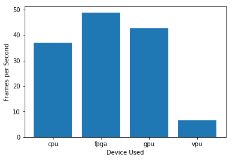

The project demonstrates how to use different IoT devices to deploy smart AI applications and testing their perofmances in the Intel's DevCloud.

There are many different options for edge AI hardware to use, but knowing which hardware for different project scenarios requires testing the application devices to determine the best hardware requirement for client's need. One possible way to test these devices before they can be deployed is runing the application on the [Intel's DevCloud]( https://devcloud.intel.com/edge/). Using the DevCloud will you to determine which hardware type best fits the clients needs and budget.

There are four main hardware types for IoT Edge AI Applications:

- CPU
- GPU
- VPU
- FPGA

# Smart Queueing System IoT Application

The application have been developed to help reduce queue congestion in different industry and is deployed to three different industry scenerios:

- Manufacturing 

- Retail and 

- Transportation

In this different scenarios, I anlysed the business situations for the clients, propose possible hardware solutions, build the smart queueing digital solutions and test its performance on the Intel's DevCloud using multiple hardware devices. Finally I compared the different performances of the hardware devices using the folowing metrics:

- Time it takes to load the model detection 

- Total inference time in seconds 

- Frames per seconds (fps)

Using these metrics, I proposed the best devices suitable for the client while also considering the client long term goal and requirements such:

- Budget 

- Performance

- Flexibility such as the ability to reprogram the device as in the case of `FPGA` which is discussed in detial in the **DEVICES.md** 

- Longetivity

- Capacity 

- Power consumption etc.

For more information on these projects, see [Project_Background](./Project_Background.md)

## Deploying the Edge AI Application on the Intel's DevCloud

There are six main steps to request an edge node with an Intel CPU, load model on the device and running inference in the Intel's DevCloud:

- Creating a python script to load the model 
- Creating a job submission script 
- Submitting a job using the `qsub` command
- Checking the job status using the `liveQStat` function
- Retrieving the output files using the `getResults` function
- Viewing the resulting output

**Important: Set up paths so we can run Dev Cloud utilities**

You must run this every time you enter a Workspace session.

`%env PATH=/opt/conda/bin:/opt/spark-2.4.3-bin-hadoop2.7/bin:/opt/conda/bin:/usr/local/sbin:/usr/local/bin:/usr/sbin:/usr/bin:/sbin:/bin:/opt/intel_devcloud_support
import os
import sys
sys.path.insert(0, os.path.abspath('/opt/intel_devcloud_support'))
sys.path.insert(0, os.path.abspath('/opt/intel'))`

The Intel DevCloud is a cloud environment that allows you to build, prototype and check the performance of your application on several different hardware devices.

There are five main components of the Intel DevCloud for the Edge:

- **User**. That's you connecting via a browser to a development server
- **Development Server**. The development server offers a Jupyter notebook, where to run the programme.
- **Job Queue**. This is where you select the hardware to run your application. In order to request the hardware, you need to submit a job requesting an _edge node_.
- **Edge Node**. You can submit your job to a hardware platform containing a specific target architecture or a combination of **CPU**, **GPU**, **VPU**, and **FPGA** architectures.
- **Inference Output**. You can view real-time performance results of your your jobs as a text file or a real-time annoted video.

# Performance Results From Different Devices Tested 

## Manufacturing Output Performance Results Analysis

**Model loading time in seconds** 

**Total inference time in seconds**

**Frame per seconds**

## Retail Output Performance Results Analysis

**Model loading time in seconds** 

**Total inference time in seconds**

**Frame per seconds**

## Transportation Output Performance Results Analysis

**Model loading time in seconds** 

**Total inference time in seconds**

**Frame per seconds**

**NOTE:** The model precision for **CPU** is FP32 while **GPU**, **FPGA** and **VPU** use FP16.

